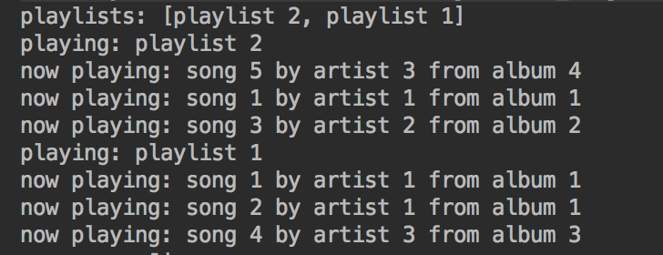
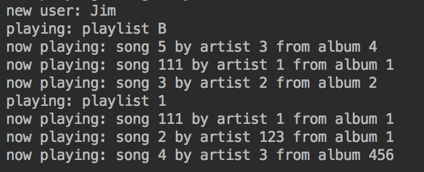

#  Classes Homework

> ***Note:*** _You can help each other, but everyone must submit their own code_

## Exercise

You're going to create some classes that represent parts of a simple music player app.

#### Requirements

- Fork & clone, then start a new IntelliJ project in the repo (no starter code)
- Create 4 classes: **Song, Playlist, User, Main**
  - Right click on the "src" folder in Project menu > New > Java Class
  - Each class must go in its own separate Java file
  - Remember that by convention, class names are capitalized
  - For all the member variables you need to create, select an access modifier that will prevent code from other classes from changing them

- **Song** class requirements
  - Define 3 member variables: `mSongName`, `mArtistName`, `mAlbumName`
  - Define a *constructor* method that takes song name, artist name, and album name as inputs, and assigns those values to the corresponding member variables
  - Define a method `play()` that just prints the name, artist, & album to the command line (since we don't know how to actually play media files yet)

- **Playlist** class requirements
  - Define 2 member variables: `mName` and `mSongs`, where the latter is an `ArrayList` of `Song` objects
  - Define a *constructor* method that does the following:
    - Takes playlist name as an input and assigns it to the corresponding member variable
    - Instantiates `mSongs` as a new, empty `ArrayList`
  - Define a method `getName()` that returns the playlist's name as a String
  - Define a method `addSong(Song song)` that takes a `Song` object as input and adds it to the list
  - Define a `playAll()` method that calls the `play()` method from each `Song` object in the list

- **User** class requirements
  - Define 2 member variables: `mName` and `mPlaylists`, where the latter is a `HashMap` that uses playlist names as keys and the corresponding `Playlist` objects as values
  - Define a *constructor* method that does the following:
    - Takes user name as an input and assigns it to the corresponding member variable
    - Instantiates `mPlaylists` as a new, empty `HashMap`
  - Define a method `addPlaylist(Playlist playlist)` that takes a `Playlist` object as an input and adds it to the `mPlaylists` map (hint: use the `getName()` method from the `Playlist` object to get the key to use for your map)
  - Define a method `getAllPlaylistNames()` that returns a collection of all the user's playlist names
  - Define a method `getPlaylistByName(String name)` that returns the `Playlist` from the collection that matches the `name` parameter. If nothing in the collection matches that input, return `null`.

- **Main** class requirements
  - Create your `main()` method here - this is where you create and manipulate instances of the other classes; do the following steps inside `main()`
  - Create a new instance of `User`
  - Create at least 5 new instances of `Song` and assign each to a variable (You can come up with creative values or just use "song1", "artist1", etc.)
  - Create at least 2 instances of `Playlist`, add multiple `Song` objects to each, then add those `Playlist` objects to your `User` object
  - Use the methods you defined and print out the names of your user's playlists, then "play" each song in each playlist so the songs print out as well

**Bonus:**
- Add methods to each class which can be used to edit the values of the member variables
- Add a method to **User** to remove a `Playlist` by name
- Call your bonus methods from `main()` to make sure they work properly (hint: if you change a playlist's name, you'll need to first remove it from `User` by specifying the old name as a key, then re-add it using the new name as the new key)

#### Deliverable

Make sure your code runs! Push to Github and submit a pull request.

Screenshot of sample output:

Screenshot of sample output for bonus:

